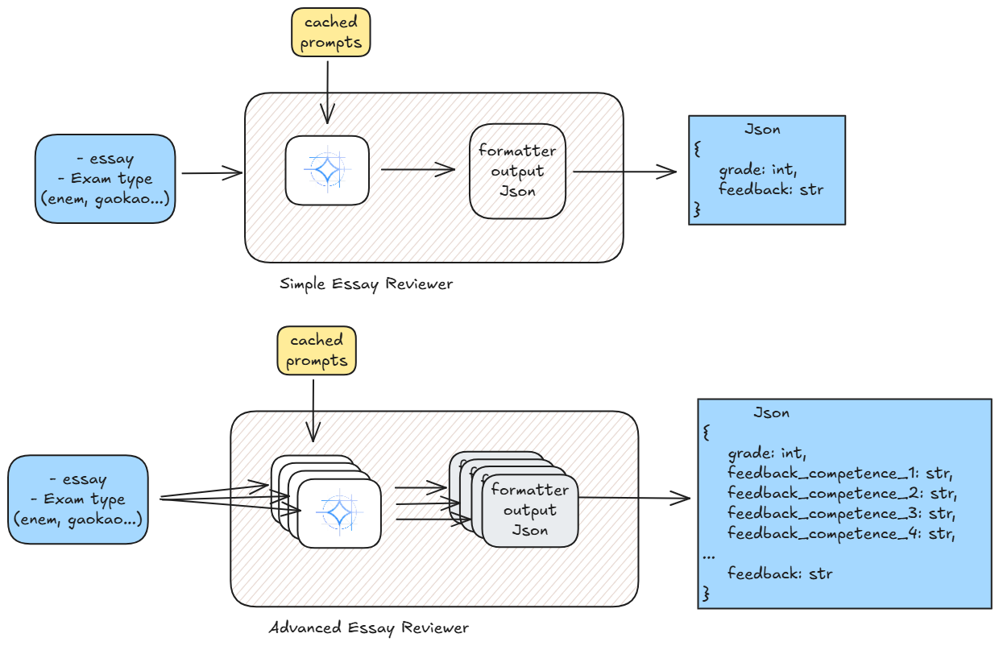
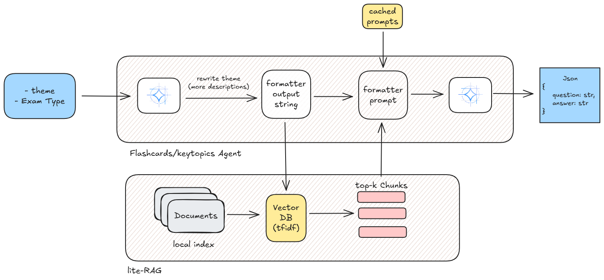
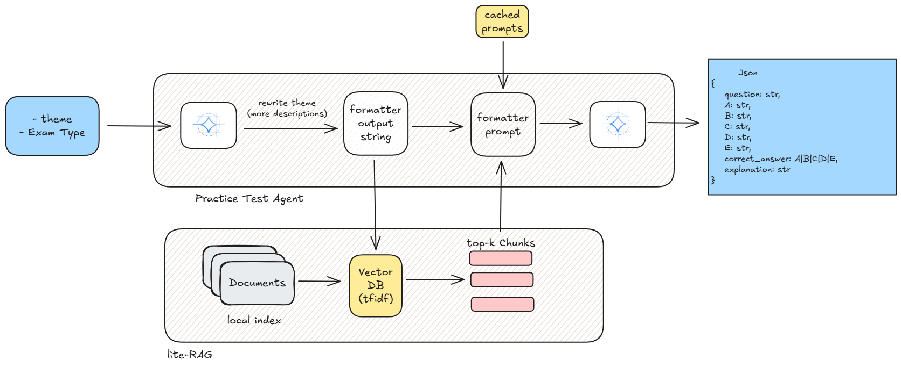
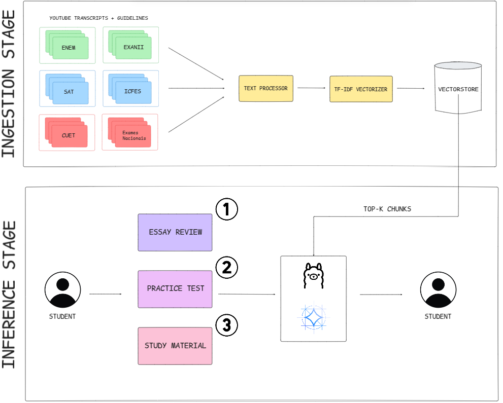
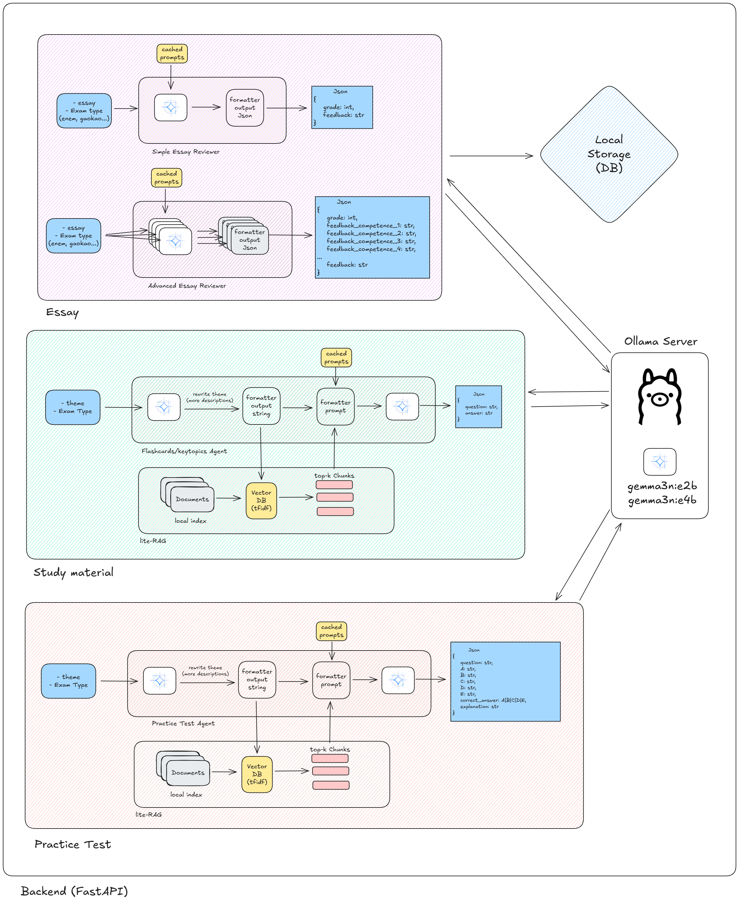

# 🎓 NeroEdu - Democratizing Global Education with AI

[](https://www.kaggle.com/competitions/google-gemma-3n-hackathon)
[](https://www.kaggle.com/competitions/google-gemma-3n-hackathon)
[](https://ai.google.dev/gemma/docs/gemma-3n)

[Full Technical Report](https://storage.googleapis.com/kaggle-forum-message-attachments/3264727/25243/NeroEdu-TechReport.pdf)

**NeroEdu tackles the global education gap by delivering autonomous AI agents — powered by Gemma 3n — that provide high-quality exam preparation (essay grading, study materials, and practice tests) directly on students’ devices, overcoming barriers like internet unavailability, lack of qualified educators, and unequal access to personalized feedback.**


## 🌟 The Mission: Mitigating Connectivity and Learning Barriers Through AI

Despite the global expansion of education technologies, millions of students still face structural barriers to learning. In regions with limited internet access, inadequate infrastructure, and shortage of qualified educators, preparing for standardized exams remains a major challenge.

**NeroEdu was created to mitigate these barriers using autonomous, on-device AI agents powered by Gemma 3n.** By running entirely offline, our platform delivers personalized learning experiences — including essay evaluation, simulated exams, and study materials — directly on low-resource devices, without requiring internet access or cloud infrastructure.

### Built for Impact

* **Global Coverage**: Supports six of the most impactful standardized exams across different countries
* **Connectivity-Free Operation**: Works fully offline, even in remote or underserved areas
* **Learning Personalization**: AI adapts to each student's level and progress
* **Data Sovereignty**: All processing happens locally — no user data is sent to the cloud
* **Scalable and Inclusive**: Freely available, with a lightweight architecture designed for accessibility at scale


## 🚀 Powered by Gemma 3n: The Future of On-Device Education

NeroEdu leverages **Gemma 3n**, a compact and efficient open-source LLM developed by Google, to enable real-time, on-device AI processing. All interactions happen locally, ensuring complete **data privacy** — no internet or cloud access is required.

Thanks to its **Matryoshka architecture**, Gemma 3n can adapt to a wide range of devices, running smoothly even on smartphones or low-end laptops. This makes it ideal for **offline learning** in regions with poor connectivity.

With **multilingual capabilities**, the model supports educational content in multiple languages, adapting to the specific context and structure of each national exam. Gemma 3n transforms AI-powered education into something scalable, inclusive, and truly accessible anywhere.


## 🎬 Educational Content Database (1000+ curated videos)

NeroEdu integrates a curated database of over **1,000 educational videos**, transcribed and indexed locally to provide contextual support for learning tasks such as essay evaluation, flashcard generation, and mock exams. This content enhances the relevance and accuracy of AI responses, even in fully offline environments. The videos cover subjects like math, language, sciences, and writing strategies, tailored to the structure and requirements of each supported exam.

### Currently supported exams:

* **ENEM** (Brazil)
* **SAT** (United States)
* **ICFES** (Colombia)
* **CUET** (India)
* **Exames Nacionais** (Portugal)
* **EXANI-II** (Mexico)
* **Gaokao** (China)
* **IELTS** (International)

By leveraging real-world content, NeroEdu delivers a grounded, practical, and adaptive learning experience across diverse educational systems — all without requiring internet connectivity.

## 🤖 AI Agents Architecture

NeroEdu includes three primary AI agents:

- **Essay Grader**: Evaluates essays based on official rubrics of each exam. For the ENEM exam, it scores texts according to the five competencies defined by INEP. The agent operates with temperature=0 to ensure deterministic outputs and returns structured JSON with scores and justification. 



- **Flashcard Generator and Key Topic Extractor**: Produces personalized and non-redundant flashcards based on the student's study history. When the lightweight RAG mode is enabled, relevant excerpts from the video transcripts are used to enrich content. Key topics are extracted and structured for focused review.



- **Mock Exam Generator**: Generates multiple-choice questions from a given topic, aligned with the structure and language of each specific exam. It incorporates automatic translation for non-Portuguese exams and applies sampling techniques (temperature + random seed) to ensure diversity. Each question includes alternatives, the correct answer, and an explanation in JSON format.



### 🔄 Backend Orchestration

The FastAPI backend orchestrates all AI agents and connects to the Ollama server running Gemma 3n locally. Each endpoint (essay, flashcard, mock exam) triggers specific retrieval + generation flows, ensuring that:

- Contextual content is fetched via TF-IDF
- Multilingual input is handled via translation (if needed)
- Gemma 3n receives structured, augmented prompts
  

<p align="center"><i>Architecture Diagram for NeroEdu</i></p>

In more detail, we can investigate how compile all the components together in one single architecture. For that, we use a FastAPI backend that orchestrates all the AI agents and connects to the Ollama server running Gemma 3n locally. Each endpoint (essay, flashcard, mock exam) triggers specific retrieval + generation flows, ensuring that:


<p align="center"><i>Architecture Diagram for Backend</i></p>


### 🔎 Lite RAG with TF-IDF for Offline Efficiency

To ensure fast and lightweight retrieval on low-end devices, NeroEdu uses a TF-IDF-based vector store instead of dense embeddings. This decision enables:

- Minimal memory and compute usage
- Fast document similarity search via cosine similarity
- Effective contextual grounding for language models without internet

Each exam (ENEM, SAT, etc.) has its own dedicated TF-IDF vector store, enabling specialized context retrieval for every use case.

The retrieved passages are dynamically injected into prompts during question generation, essay evaluation, or flashcard creation — enabling the system to provide accurate, grounded responses even offline.


## 🛠️ Getting Started

### Prerequisites
- Python 3.8+
- Node.js 16+ (for desktop app)
- Xcode (for iOS development)
- Ollama with Gemma 3n models

### Quick Setup
```bash
# Clone the repository
git clone <repository-url>
cd neroedu-gemma3n

# Backend setup
pip install -r requirements.txt
python main.py

# Desktop application
cd neroedu-desktop 
npm install 
npm run build:dll
npm start
```

*Detailed installation and configuration instructions*

## 🏆 Kaggle Gemma 3n Challenge

This project represents our submission to the **Kaggle Gemma 3n Challenge** in the **"Revolutionize Education"** category. We're leveraging Gemma 3n's unique capabilities to create meaningful, positive change in global education access.

### Why This Matters
- **Real-World Impact**: Addresses education inequality affecting millions of students
- **Technical Innovation**: Demonstrates Gemma 3n's potential for social good  
- **Scalable Solution**: Architecture designed for global deployment
- **Privacy-Centric**: Aligns with modern data protection requirements
  
---

## 📄 License

This project is open-source and available under the MIT License. We believe education should be free and accessible to all.

---

**Built with ❤️ for global education equity**  
*Empowering students worldwide through innovative AI technology*

> *"Education is the most powerful weapon which you can use to change the world."* - Nelson Mandela
